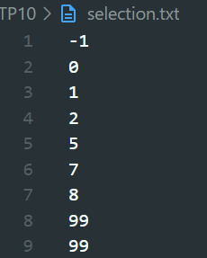

<p>
  
Name: Virak Rith

Student ID: P20230033

Course: Data Structures and Algorithms

Instructor: SEAK Leng

Assignment: TP-10

Due Date: July 22, 2025 (11:59 AM)

</p>
<br/>

# Exercise 1

Write a C++ program to sort 5 integer numbers stored in an array from user input using bubble sort
algorithm. Sort from smallest to largest and also sort from largest to smallest. Display result on screen.

## Source Code

```C++
#include<iostream>
using namespace std;

void bubbleSort(int num[],int n){

    for (int i = 0; i < n - 1;i++)
    {
        bool flag = false;
        for (int j = 0; j < n - 1 - i;j++){
            if ( num[j]>num[j+1]){
                swap(num[j], num[j + 1]);
                flag = true;
            }
        }
        if (!flag)
            break;
    }
}
void display(int num[],int n){
    for (int i = 0; i < n;i++){
        cout << num[i] << " ";
    }
    cout << endl;
}


int main(){

    int num[] = {3, 5, 2, 5, 7, 9, 3};
    int n = sizeof(num) / sizeof(num[0]);
    display(num,n);
    bubbleSort(num, n);
    display(num,n);
    return 0;
}
```

## Output

```C++
3 5 2 5 7 9 3
2 3 3 5 5 7 9
```

# Exercise 2

## Source Code

```C++
#include <iostream>
#include <fstream>
using namespace std;

void swap(int *a, int *b){
    int temp = *a;
    *a = *b;
    *b = temp;
}

void selectionSort(int numbers[], int size){
    for(int i = 0; i < size - 1; i++){
        int minIndex = i;
        for(int j = i + 1; j < size; j++){
            if(numbers[j] < numbers[minIndex]) {
                minIndex = j;
            }
        }
        if(minIndex != i) {
            swap(numbers[i], numbers[minIndex]);
        }
    }
}

int main(){

    const int MAX_SIZE = 9;
    int numbers[MAX_SIZE];
    int count = 0;

    ifstream read("input.txt");
    ofstream write("selection.txt");

    if(!read) {
        cerr << "Error: Cannot open input.txt" << endl;
        return 1;
    }

    while(read >> numbers[count]) {
        count++;
        if(count >= MAX_SIZE) break;
    }

    read.close();

    selectionSort(numbers, count);

    for(int i = 0; i < count; i++){
        write << numbers[i] << endl;
    }

    write.close();

    cout << "Sorted numbers written to selection.txt" << endl;

    return 0;
}
```

## Output:

```C++
Sorted numbers written to selection.txt
```



# Exercise 3

Given a student list below. Read data from csv file into an array. Sort the data in array using an insertion
algorithm.

The program should be able to sort the data by … (provide a menu of choice to a user)

    a. Sort by ID
    b. Sort by name
    c. Sort by gender

## Source Code:

```C++
#include <iostream>
#include <fstream>
#include <sstream>
#include <string>
using namespace std;

struct Student {
    int id;
    string name;
    char gender;
    string dob;
};

void insertionSort(Student arr[], int size, int choice){
    for(int i = 1; i < size; i++){
        Student key = arr[i];
        int j = i - 1;

        if(choice == 1){
            while(j >= 0 && key.id < arr[j].id) {
                arr[j + 1] = arr[j];
                j--;
            }
        } else if(choice == 2) {
            while(j >= 0 && key.name < arr[j].name) {
                arr[j + 1] = arr[j];
                j--;
            }
        } else if(choice == 3) {
            while(j >= 0 && key.gender < arr[j].gender) {
                arr[j + 1] = arr[j];
                j--;
            }
        }

        arr[j + 1] = key;
    }
}

void display(Student arr[], int size) {
    cout << "ID\tName\tGender\tDOB\n";
    for(int i = 0; i < size; i++){
        cout << arr[i].id << "\t" << arr[i].name << "\t" << arr[i].gender << "\t" << arr[i].dob << endl;
    }
}

int main(){

    const int MAX_SIZE = 100;
    Student students[MAX_SIZE];
    int count = 0;

    ifstream read("students.csv");
    if(!read){
        cerr << "Error: Cannot open students.csv\n";
        return 1;
    }

    string line;
    while(getline(read, line) && count < MAX_SIZE) {
        stringstream ss(line);
        string idStr, name, genderStr, dob;
        getline(ss, idStr, ',');
        getline(ss, name, ',');
        getline(ss, genderStr, ',');
        getline(ss, dob, ',');

        students[count].id = stoi(idStr);
        students[count].name = name;
        students[count].gender = genderStr[0];;
        students[count].dob = dob;
        count++;
    }
    read.close();

    int choice;
    cout << "Choose sorting option:\n";
    cout << "1. Sort by ID\n";
    cout << "2. Sort by Name\n";
    cout << "3. Sort by Gender\n";
    cout << "Enter your choice (1-3): ";
    cin >> choice;

    if(choice < 1 || choice > 3){
        cout << "Invalid choice.\n";
        return 1;
    }

    insertionSort(students, count, choice);

    cout << "\nSorted Student List:\n";
    display(students, count);

    return 0;
}
```

## Output:

```C++
Choose sorting option:
1. Sort by ID
2. Sort by Name
3. Sort by Gender
Enter your choice (1-3): 1

Sorted Student List:
ID      Name    Gender  DOB
1000    Jack    M       22-Sep-81
1002    Rose    F       23-Oct-90
1003    Ratha   M       20-Dec-91
1009    Sokha   F       11-Feb-90
1010    Sok     M       12-Jan-93
1023    Sitha   F       21-Sep-90
1025    Dara    M       10-Jan-91

Enter your choice (1-3): 2

Sorted Student List:
ID      Name    Gender  DOB
1025    Dara    M       10-Jan-91
1000    Jack    M       22-Sep-81
1003    Ratha   M       20-Dec-91
1002    Rose    F       23-Oct-90
1023    Sitha   F       21-Sep-90
1010    Sok     M       12-Jan-93
1009    Sokha   F       11-Feb-90

Enter your choice (1-3): 3

Sorted Student List:
ID      Name    Gender  DOB
1009    Sokha   F       11-Feb-90
1023    Sitha   F       21-Sep-90
1002    Rose    F       23-Oct-90
1010    Sok     M       12-Jan-93
1025    Dara    M       10-Jan-91
1000    Jack    M       22-Sep-81
1003    Ratha   M       20-Dec-**91**
```

# Exercise 4

Ask user for 10 numbers and store in a single linked list. Sort data in your linked list using bubble sort
algorithm. Display the sorted data in your linked list.

## Source Code:

```C++
#include<iostream>
using namespace std;

struct Element {
    int num;
    Element* next;
};

struct List {
    Element* head;
    Element* tail;
    int n;
};

List* createList() {
    List* ls = new List;
    ls->head = nullptr;
    ls->tail = nullptr;
    ls->n = 0;
    return ls;
}
void add(List *ls, int num){
    Element *e = new Element;
    e->num = num;
    e->next = ls->head;
    ls->head = e;
    if (ls->tail == nullptr) {
        ls->tail = e;
    }
    ls->n++;
}

void Swap(int *a, int* b){
    int temp = *a;
    *a = *b;
    *b = temp;
}

void bubbleSort(List* ls){
    if(ls->n <2) return;
    bool swapped;
    Element *end = nullptr;
    do {
        swapped = false;
        Element* current = ls->head;
        while (current->next != end){
            if (current->num > current->next->num) {
                swap(current->num, current->next->num);
                swapped = true;
            }
            current = current->next;
        }
        end = current;
    } while (swapped);
}

void display(List* ls) {
    Element* current = ls->head;
    while (current != nullptr) {
        cout << current->num << " ";
        current = current->next;
    }
    cout << endl;
}


int main(){
    List* myList = createList();
    add(myList, 5);
    add(myList, 3);
    add(myList, 8);
    add(myList, 1);
    add(myList, 4);
    cout << "Before sorting:" << endl;
    display(myList);
    bubbleSort(myList);
    cout << "After sorting:" << endl;
    display(myList);

    return 0;
}
```

## Output:

```C++
Before sorting:
4 1 8 3 5
After sorting:
1 3 4 5 8
```

## Link to GitHub Account : [Click Here](https://github.com/Poppykhim/DS-TP.git) <3
