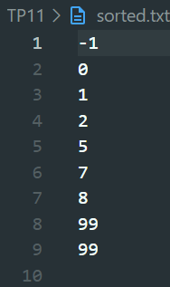

<p>
  
Name: Virak Rith

Student ID: P20230033

Course: Data Structures and Algorithms

Instructor: SEAK Leng

Assignment: TP-11

Due Date: July 22, 2025 (11:59 AM)

</p>
<br/>

# Exercise 1

Write a C++ program to sort 5 integer numbers stored in an array from user input using Merge sort
algorithm. Display result on screen.

## Source Code

```C++
#include <iostream>
using namespace std;

struct Element {
    int data;
    Element *next;
};

struct List {
    int size;
    Element *head;
    Element *tail;
};

List *createList(){
    List *ls = new List;
    ls->size = 0;
    ls->head = nullptr;
    ls->tail = nullptr;
    return ls;
}

void addEnd(List *ls, int data) {
    Element *e = new Element;
    e->data = data;
    e->next = nullptr;
    if(ls->size == 0) {
        ls->head = e;
    } else {
        ls->tail->next = e;
    }
    ls->tail = e;
    ls->size++;
}

void display(List *ls) {
    Element *temp = ls->head;
    cout << "Merge Sort: ";
    while(temp != nullptr) {
        cout << temp->data << " ";
        temp = temp->next;
    }
    cout << endl;
}

Element *getNodeAt(List *ls, int index) {
    Element *current = ls->head;
    int i = 0;
    while(current != nullptr && i < index) {
        current = current->next;
        i++;
    }
    return current;
}

void Merge(List *ls, int lb, int mid, int ub) {
    int i = lb;
    int j = mid + 1;
    int k = 0;
    int n = ub - lb + 1;
    int *b = new int[n];

    Element *left = getNodeAt(ls, i);
    Element *right = getNodeAt(ls, j);

    while(i <= mid && j <= ub) {
        if(left->data < right->data) {
            b[k++] = left->data;
            left = left->next;
            i++;
        } else {
            b[k++] = right->data;
            right = right->next;
            j++;
        }
    }

    while(i <= mid) {
        b[k++] = left->data;
        left = left->next;
        i++;
    }

    while(j <= ub) {
        b[k++] = right->data;
        right = right->next;
        j++;
    }

    Element *current = getNodeAt(ls, lb);
    for(k = 0; k < n; k++) {
        current->data = b[k];
        current = current->next;
    }

    delete[] b;
}

void MergeSort(List *ls, int lb, int ub) {
    if(lb < ub) {
        int mid = (lb + ub) / 2;
        MergeSort(ls, lb, mid);
        MergeSort(ls, mid + 1, ub);
        Merge(ls, lb, mid, ub);
    }
}

void mergeSort(List *ls) {
    if(ls->size > 1) {
        MergeSort(ls, 0, ls->size - 1);
    }
}

int main(){

    List *ls = createList();
    int number;

    for(int i = 0; i < 5; i++) {
        cout << "Input number #" << (i + 1) << ": ";
        cin >> number;
        addEnd(ls, number);
    }
    cout << endl;

    mergeSort(ls);

    display(ls);

    return 0;
}
```

## Output

```C++
Input number #1: 3
Input number #2: 2
Input number #3: 4
Input number #4: 6
Input number #5: 2

Merge Sort: 2 2 3 4 6
```

# Exercise 2

Read data from the txt file below and store in an array. Sort that array using the Merge sort algorithms
and write sorted array into new files namely selection.txt.

## Source Code

```C++
#include <iostream>
#include <fstream>
using namespace std;

void Merge(int a[], int lb, int mid, int ub) {
    int i = lb;
    int j = mid + 1;
    int k = 0;
    int n = ub - lb + 1;
    int *b = new int[n];

    while(i <= mid && j <= ub) {
        if(a[i] < a[j]) {
            b[k++] = a[i++];
        } else {
            b[k++] = a[j++];
        }
    }

    while(i <= mid) {
        b[k++] = a[i++];
    }

    while(j <= ub) {
        b[k++] = a[j++];
    }

    for(k = 0; k < n; k++){
        a[lb + k] = b[k];
    }

    delete[] b;
}

void MergeSort(int a[], int lb, int ub) {
    if(lb < ub) {
        int mid = (lb + ub) / 2;
        MergeSort(a, lb, mid);
        MergeSort(a, mid + 1, ub);
        Merge(a, lb, mid, ub);
    }
}

int main() {

    ifstream read("unsorted.txt");
    ofstream write("sorted.txt");

    if(!read.is_open()) {
        cerr << "Error: Could not open unsorted.txt file!" << endl;
        return 1;
    }

    int temp, count = 0;
    while(read >> temp) {
        count++;
    }

    read.clear();
    read.seekg(0, ios::beg);

    int *a = new int[count];
    for(int i = 0; i < count; i++) {
        read >> a[i];
    }
    read.close();

    MergeSort(a, 0, count - 1);

    for(int i = 0; i < count; i++) {
        write << a[i] << endl;
    }
    write.close();

    cout << "Sorted Array: ";
    for(int i = 0; i < count; i++) {
        cout << a[i] << " ";
    }
    cout << "\nSorted data written to sorted.txt successfully!" << endl;

    delete[] a;
    return 0;
}
```

## Output:

```C++
Sorted Array: -1 0 1 2 5 7 8 99 99
Sorted data written to sorted.txt successfully!
```



# Exercise 3

Write a C++ program to sort 5 integer numbers stored in an array from user input using Quick sort
algorithm. Sort from largest to smallest. Display result on screen.

## Source Code:

```C++
#include <iostream>
using namespace std;

void swap(int *a, int *b) {
    int temp = *a;
    *a = *b;
    *b = temp;
}

int Partition(int a[], int lb, int ub) {
    int pivot = a[lb];
    int start = lb;
    int end = ub;
    while(start < end) {
        while(a[start] >= pivot && start <= ub) {
            start++;
        }
        while(a[end] < pivot && end >= lb) {
            end--;
        }
        if(start < end) {
            swap(a[start], a[end]);
        }
    }

    swap(a[lb], a[end]);
    return end;
}

void QuickSort(int a[], int lb, int ub) {
    if(lb < ub) {
        int pos = Partition(a, lb, ub);
        QuickSort(a, lb, pos - 1);
        QuickSort(a, pos + 1, ub);
    }
}

int main() {

    int number[5];

    int size = sizeof(number) / sizeof(number[0]);

    for(int i = 0; i < size; i++) {
        cout << "Input number #" << (i + 1) << ": ";
        cin >> number[i];
    }

    QuickSort(number, 0, size - 1);

    cout << endl;
    cout << "Quick Sort: ";
    for(int i = 0; i < size; i++) {
        cout << number[i] << " ";
    }

    return 0;
}
```

## Output:

```C++
Input number #1: 2
Input number #2: 3
Input number #3: 4
Input number #4: 1
Input number #5: -1

Quick Sort: 4 3 2 1 -1
```

# Exercise 4

Given a student list below. Read data from csv file into an array. Sort the data in array using Quick
algorithm.

The program should be able to sort the data by … (provide a menu of choice to a user)

    a. Sort by ID
    b. Sort by name
    c. Sort by gender

## Source Code:

```C++
#include <iostream>
#include <fstream>
#include <sstream>
#include <string>
#include <algorithm>
using namespace std;

struct Student {
    int id;
    string name;
    char gender;
    string dob;
};

bool compare(const Student &a, const Student &b, int choice) {
    if(choice == 1) return a.id < b.id;
    if(choice == 2) return a.name < b.name;
    if(choice == 3) return a.gender < b.gender;
    return false;
}

int partition(Student a[], int low, int high, int choice) {
    Student pivot = a[low];
    int i = low - 1;
    int j = high + 1;

    while (true) {
        do { i++; } while (compare(a[i], pivot, choice));     // a[i] < pivot
        do { j--; } while (compare(pivot, a[j], choice));     // pivot < a[j]
        if (i >= j) return j;
        swap(a[i], a[j]);
    }
}

void QuickSort(Student a[], int low, int high, int choice) {
    if (low < high) {
        int p = partition(a, low, high, choice);
        QuickSort(a, low, p, choice);
        QuickSort(a, p + 1, high, choice);
    }
}

void display(Student stu[], int n) {
    cout << "ID\tName\tGender\tDoB\n";
    for(int i = 0; i < n; i++) {
        cout << stu[i].id << "\t" << stu[i].name << "\t" << stu[i].gender << "\t" << stu[i].dob << "\n";
    }
}

int main() {

    ifstream read("students.csv");
    if(!read) {
        cerr << "Error: can't open students.csv!" << endl;
        return 1;
    }

    Student students[100];
    int count = 0;
    string line;

    if (getline(read, line)) {
        if (line.find("ID") == string::npos) {
            stringstream ss(line);
            string idStr, name, genderStr, dob;
            getline(ss, idStr, ',');
            getline(ss, name, ',');
            getline(ss, genderStr, ',');
            getline(ss, dob);                 // read till end
            students[count++] = {stoi(idStr), name, genderStr[0], dob};
        }
    }

    while(getline(read, line) && count < 100) {
        stringstream ss(line);
        string idStr, name, genderStr, dob;
        getline(ss, idStr, ',');
        getline(ss, name, ',');
        getline(ss, genderStr, ',');
        getline(ss, dob, ',');

        students[count].id = stoi(idStr);
        students[count].name = name;
        students[count].gender = genderStr[0];
        students[count].dob = dob;
        count++;
    }
    read.close();

    int choice;
    cout << "Sort by:\n1. ID\n2. Name\n3. Gender\nEnter choice: ";
    cin >> choice;

    QuickSort(students, 0, count -1, choice);

    cout << "\nSorted Students:\n";
    display(students, count);

    return 0;
}
```

## Output:

```C++
Sort by:
1. ID
2. Name
3. Gender
Enter choice: 1

Sorted Students:
ID      Name    Gender  DoB
1000    Jack    M       22-Sep-81
1002    Rose    F       23-Oct-90
1003    Ratha   M       20-Dec-91
1009    Sokha   F       11-Feb-90
1010    Sok     M       12-Jan-93
1023    Sitha   F       21-Sep-90
1025    Dara    M       10-Jan-91

Enter choice: 2

Sorted Students:
ID      Name    Gender  DoB
1025    Dara    M       10-Jan-91
1000    Jack    M       22-Sep-81
1003    Ratha   M       20-Dec-91
1002    Rose    F       23-Oct-90
1023    Sitha   F       21-Sep-90
1010    Sok     M       12-Jan-93
1009    Sokha   F       11-Feb-90

Enter choice: 3

Sorted Students:
ID      Name    Gender  DoB
1009    Sokha   F       11-Feb-90
1002    Rose    F       23-Oct-90
1023    Sitha   F       21-Sep-90
1000    Jack    M       22-Sep-81
1003    Ratha   M       20-Dec-91
1010    Sok     M       12-Jan-93
1025    Dara    M       10-Jan-91
```

## Link to GitHub Account : [Click Here](https://github.com/Poppykhim/DS-TP.git) <3
