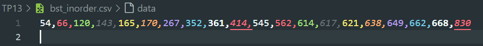

<p>
  
Name: Virak Rith

Student ID: P20230033

Course: Data Structures and Algorithms

Instructor: SEAK Leng

Assignment: TP-13

Due Date: July 22, 2025 (11:59 AM)

</p>
<br/>

# Exercise 1

Suppose that we want to store ID of ITC students in a binary search tree (BST). Create a data structure for
this program. Hint: Create element for the tree, insert function, traverse the tree via in-order, preorder or
post-order method.

## Source Code

```C++
#include <iostream>
using namespace std;

struct Node {
    string id;
    Node* left;
    Node* right;
};

Node* insert(Node* root, string id) {
    if(root == nullptr) {
        root = new Node;
        root->id = id;
        root->left = nullptr;
        root->right = nullptr;
    } else if (id < root->id) {
        root->left = insert(root->left, id);
    } else if (id > root->id) {
        root->right = insert(root->right, id);
    }
    return root;
}

void preorder(Node* root) {
    if(root != nullptr) {
        cout << root->id << " ";
        preorder(root->left);
        preorder(root->right);
    }
}

void inorder(Node* root) {
    if(root != nullptr) {
        inorder(root->left);
        cout << root->id << " ";
        inorder(root->right);
    }
}

void postorder(Node* root) {
    if(root != nullptr) {
        postorder(root->left);
        postorder(root->right);
        cout << root->id << " ";
    }
}

int main() {
    Node* root = nullptr;

    root = insert(root, "p20230018");

    insert(root, "p20230011");
    insert(root, "p20230012");
    insert(root, "p20230013");
    insert(root, "p20230014");

    cout << "Pre-Order: ";
    preorder(root);
    cout << endl;

    cout << "In-Order: ";
    inorder(root);
    cout << endl;

    cout << "Post-Order: ";
    postorder(root);
    return 0;
}
```

## Output

```C++
Pre-Order: p20230018 p20230011 p20230012 p20230013 p20230014
In-Order: p20230011 p20230012 p20230013 p20230014 p20230018
Post-Order: p20230014 p20230013 p20230012 p20230011 p20230018
```

# Exercise 2

Random 20 numbers in this ranges [10 – 1000] then store in a binary search tree. Display data from this
free using in-order traversal method and also write them to a file (txt or CSV).

## Source Code

```C++
#include <iostream>
#include <fstream>
#include <cstdlib>
#include <ctime>
using namespace std;

struct Node {
    int data;
    Node* left;
    Node* right;
};

Node* insert(Node* root, int data) {
    if (root == nullptr) {
        root = new Node;
        root->data = data;
        root->left = nullptr;
        root->right = nullptr;
    } else if (data < root->data) {
        root->left = insert(root->left, data);
    } else {
        root->right = insert(root->right, data);
    }
    return root;
}

void inorder(Node* root) {
    if (root != nullptr) {
        inorder(root->left);
        cout << root->data << " ";
        inorder(root->right);
    }
}

void inorderWriteCSV(Node* root, ofstream& write, bool& first) {
    if (root != nullptr) {
        inorderWriteCSV(root->left, write, first);
        if (!first) write << ",";
        write << root->data;
        first = false;
        inorderWriteCSV(root->right, write, first);
    }
}

int main() {
    Node* root = nullptr;

    srand(static_cast<unsigned>(time(nullptr)));
    for (int i = 0; i < 20; i++) {
        int data = 10 + (rand() % (1000 - 10 + 1));
        root = insert(root, data);
    }

    cout << "In-order traversal: ";
    inorder(root);
    cout << endl;

    ofstream fout("bst_inorder.csv");
    if (fout) {
        bool first = true;
        inorderWriteCSV(root, fout, first);
        fout << "\n";
        fout.close();
        cout << "Saved in-order data to: bst_inorder.csv\n";
    } else {
        cout << "Error: cannot open bst_inorder.csv for writing.\n";
    }

    return 0;
}

```

## Output:

```C++
In-order traversal: 54 66 120 143 165 170 267 352 361 414 545 562 614 617 621 638 649 662 668 830
Saved in-order data to: bst_inorder.csv
```



# Exercise 3

Create a binary search tree (BST) data structure that can store numbers. Read data from the file below
and store in this tree. Then

    a. Display data using pre-order traversal.
    b. Display data using in-order traversal.
    c. Display data using post-order traversal.

## Source Code:

```C++
#include <iostream>
#include <fstream>
#include <cctype>
using namespace std;

struct Node {
    int data;
    Node* left;
    Node* right;
};

Node* insert(Node* root, int data) {
    if (root == nullptr) {
        root = new Node;
        root->data = data;
        root->left = nullptr;
        root->right = nullptr;
    } else if (data < root->data) {
        root->left = insert(root->left, data);
    } else {
        root->right = insert(root->right, data);
    }
    return root;
}

void preorder(Node* root) {
    if (root != nullptr) {
        cout << root->data << " ";
        preorder(root->left);
        preorder(root->right);
    }
}

void inorder(Node* root) {
    if (root != nullptr) {
        inorder(root->left);
        cout << root->data << " ";
        inorder(root->right);
    }
}

void postorder(Node* root) {
    if (root != nullptr) {
        postorder(root->left);
        postorder(root->right);
        cout << root->data << " ";
    }
}

int main() {
    Node* root = nullptr;

    ifstream read("bst_file.txt");

    if (!read) {
        cerr << "Error: cannot open file.\n";
        return 1;
    }

    int line;

    while(read >> line) {
        root = insert(root, line);
    }

    cout << "Pre-order : ";
    preorder(root);
    cout << "\nIn-order  : ";
    inorder(root);
    cout << "\nPost-order: ";
    postorder(root);
    cout << "\n";

    return 0;
}
```

## Output:

```C++
Pre-order : 99 2 0 -1 1 7 5 8 99
In-order  : -1 0 1 2 5 7 8 99 99
Post-order: -1 1 0 5 8 7 2 99 99
```

# Exercise 4

Ask a user for a number, say n. Then loop n times to get names and ages of n students. Store names of
students into a binary search tree.

    a. Display data in the tree using in-order traversal. Write those data into a file (txt or CSV).
    b. Find the student who has the youngest age.
    c. Find the student who has the oldest age.

## Source Code:

```C++
#include <iostream>
#include <fstream>
#include <string>
using namespace std;

struct Node {
    string name;
    int age;
    Node* left;
    Node* right;
};

Node* insert(Node* root, const string& name, int age) {
    if (root == nullptr) {
        root = new Node;
        root->name = name;
        root->age = age;
        root->left = nullptr;
        root->right = nullptr;
    } else if (name < root->name) {
        root->left = insert(root->left, name, age);
    } else if (name > root->name) {
        root->right = insert(root->right, name, age);
    } else {
        root->age = age;
    }
    return root;
}

void inorder(Node* root) {
    if (root != nullptr) {
        inorder(root->left);
        cout << root->name << " (" << root->age << ")\n";
        inorder(root->right);
    }
}

void inorderWriteCSV(Node* root, ofstream& write) {
    if (root != nullptr) {
        inorderWriteCSV(root->left, write);
        write << root->name << "," << root->age << "\n";
        inorderWriteCSV(root->right, write);
    }
}

void findYoungest(Node* root, Node*& best) {
    if (root == nullptr) return;
    if (best == nullptr || root->age < best->age) best = root;
    findYoungest(root->left, best);
    findYoungest(root->right, best);
}

void findOldest(Node* root, Node*& best) {
    if (root == nullptr) return;
    if (best == nullptr || root->age > best->age) best = root;
    findOldest(root->left, best);
    findOldest(root->right, best);
}

int main() {
    Node* root = nullptr;

    int n;
    cout << "Enter number of students: ";
    if (!(cin >> n) || n <= 0) {
        cout << "Invalid n.\n";
        return 1;
    }

    for (int i = 1; i <= n; ++i) {
        string name;
        int age;

        cout << "Student #" << i << " name: ";
        getline(cin >> ws, name);
        cout << "Student #" << i << " age : ";
        cin >> age;

        root = insert(root, name, age);
    }

    cout << "\n=== In-order (by name) ===\n";
    inorder(root);

    ofstream write("students_inorder.csv");
    if (write) {
        write << "Name,Age\n";
        inorderWriteCSV(root, write);
        write.close();
        cout << "Saved to students_inorder.csv\n";
    } else {
        cout << "Error: cannot write students_inorder.csv\n";
    }

    Node* youngest = nullptr;
    findYoungest(root, youngest);
    if (youngest) {
        cout << "\nThe Youngest: " << youngest->name << " (" << youngest->age << ")\n";
    }

    Node* oldest = nullptr;
    findOldest(root, oldest);
    if (oldest) {
        cout << "The Oldest  : " << oldest->name << " (" << oldest->age << ")\n";
    }

    return 0;
}

```

## Output:

```C++
Enter number of students: 2
Student #1 name: Rith
Student #1 age : 18
Student #2 name: Bro
Student #2 age : 33

=== In-order (by name) ===
Bro (33)
Rith (18)
Saved to students_inorder.csv

The Youngest: Rith (18)
The Oldest  : Bro (33)
```

# Exercise 5

Create a file containing 20 employees’ info, where each employee has employee ID (starting with emp001),
first name, last name, position, gender and phone number.

    ▪ Read data from this file then store in a binary search tree.
    ▪ Write a function to search for an employee based on his/her employee ID. This function asks a user to
    input an employee ID to be searched in the tree.
    ▪ Test your program and call the search function above

## Source Code:

```C++
#include <iostream>
#include <fstream>
#include <string>
using namespace std;

struct Employee {
    string id;
    string first;
    string last;
    string position;
    string gender;
    string phone;
};

struct Node {
    Employee e;
    Node* left;
    Node* right;
};

Node* insert(Node* root, const Employee& emp) {
    if (root == nullptr) {
        root = new Node;
        root->e = emp;
        root->left = nullptr;
        root->right = nullptr;
    } else if (emp.id < root->e.id) {
        root->left = insert(root->left, emp);
    } else if (emp.id > root->e.id) {
        root->right = insert(root->right, emp);
    } else {
        root->e = emp;
    }
    return root;
}

Node* search(Node* root, const string& id) {
    if (root == nullptr) return nullptr;
    if (id == root->e.id) return root;
    if (id < root->e.id) return search(root->left, id);
    return search(root->right, id);
}

void inorder(Node* root) {
    if (root != nullptr) {
        inorder(root->left);
        cout << root->e.id << " | "
             << root->e.first << " " << root->e.last << " | "
             << root->e.position << " | "
             << root->e.gender << " | "
             << root->e.phone << "\n";
        inorder(root->right);
    }
}

bool splitCSVLine(const string& line, Employee& emp) {
    string fields[6];
    int fieldIndex = 0;
    string current = "";

    for (size_t i = 0; i < line.size(); i++) { // size_t: unsigned integer
        char c = line[i];
        if (c == ',') {
            if (fieldIndex < 6) {
                fields[fieldIndex++] = current;
                current = "";
            }
        } else {
            current += c;
        }
    }
    if (fieldIndex < 6) {
        fields[fieldIndex++] = current;
    }

    if (fieldIndex != 6) return false;

    emp.id       = fields[0];
    emp.first    = fields[1];
    emp.last     = fields[2];
    emp.position = fields[3];
    emp.gender   = fields[4];
    emp.phone    = fields[5];
    return true;
}

bool loadFromCSV(const string& filename, Node*& root) {
    ifstream read(filename.c_str());
    if (!read) return false;

    string line;
    while (getline(read, line)) {
        if (line.size() == 0) continue;
        Employee emp;
        if (splitCSVLine(line, emp)) {
            root = insert(root, emp);
        }
    }
    read.close();
    return true;
}

int main() {
    Node* root = nullptr;

    string filename = "employees.csv";
    if (!loadFromCSV(filename, root)) {
        cout << "Error: cannot open '" << filename << "'.\n";
        return 1;
    }

    cout << "=== Employees (read-order by ID) ===\n";
    inorder(root);

    string q;
    cout << "\nEnter employee ID to search (e.g., emp007): ";
    getline(cin >> ws, q);

    Node* found = search(root, q);
    if (found) {
        cout << "Found:\n";
        cout << "  ID      : " << found->e.id << "\n";
        cout << "  Name    : " << found->e.first << " " << found->e.last << "\n";
        cout << "  Position: " << found->e.position << "\n";
        cout << "  Gender  : " << found->e.gender << "\n";
        cout << "  Phone   : " << found->e.phone << "\n";
    } else {
        cout << "Employee ID '" << q << "' not found.\n";
    }

    return 0;
}

```

## Output:

```C++
=== Employees (read-order by ID) ===
emp001 | Alex Kim | Engineer | M | 012345001
emp002 | Sara Ly | Designer | F | 012345002
emp003 | John Doe | Manager | M | 012345003
emp004 | Nita Chea | QA | F | 012345004
emp005 | Rith Sok | Engineer | M | 012345005
emp006 | Lea Sun | HR | F | 012345006
emp007 | Mony Pov | Engineer | M | 012345007
emp008 |  Lina Suon | Accountant | F | 012345008
emp009 | David Chan | Engineer | M | 012345009
emp010 | Veasna Sam | Support | M | 012345010
emp011 | Sophia Or | Engineer | F | 012345011
emp012 | Vanna Kea | Designer | M | 012345012
emp013 | Mira Kim | Engineer | F | 012345013
emp014 | Chenda Sao | Engineer | F | 012345014
emp015 | Kosal Hing | Manager | M | 012345015
emp016 | Ravy Mean | Support | F | 012345016
emp017 | Sitha Chum | HR | M | 012345017
emp018 | Kanha Ou | Engineer | F | 012345018
emp019 | Sokha Im | Engineer | M | 012345019
emp020 |  Dara Meas | QA | M | 012345020

Enter employee ID to search (e.g., emp007): emp019
Found:
  ID      : emp019
  Name    : Sokha Im
  Position: Engineer
  Gender  : M
  Phone   : 012345019
```

# Exercise 6

## Source Code

```C++

```

## Output:

```C++

```

# Exercise 7

## Example code

```C++

```

## Source Code

```C++

```

## Output:

```C++

```

## Link to GitHub Account : [Click Here](https://github.com/Poppykhim/DS-TP.git) <3
